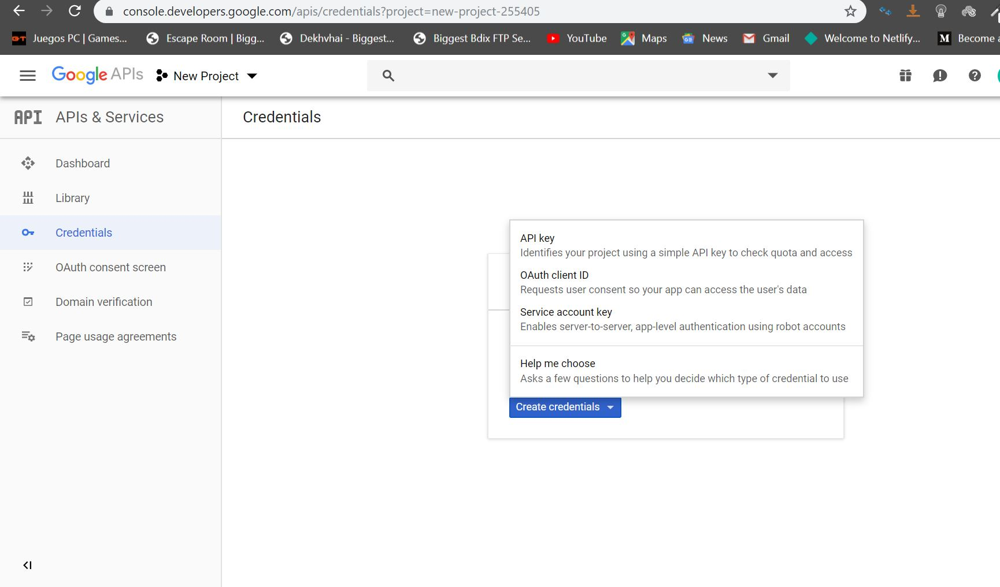

# send-mail-gmailapi-nodejs

img1: go to "https://console.developers.google.com/apis" and create a new project clicking on down arrow

img2: then again click on down arrow and select your project

img3: then this page will appear and select gmail api and enable it

img4: then this page will appear and click on create credentials

img5: then in this page click on OAuth consent screen

img6: then this page will appear and click on create credentials

img7: here click on OAuth client Id

img8: then this page will appear click on web application

img9: then here name your client and open a new tab check (img10)

img10: go to "developers.google.com/oauthplayground" and copy this link and paste it in authorized redirect uris -> (img9), check (img11)

img11: after pasting , click on create

img12: then page will appear. click on download icon and download it. move this file to project folder and name it as you want. and then click on your client name

img13: then this page will appear. copy your client id and secret and paste it in check (img14)

img14: after pastin select gmail api from left side and click authorize apis

img15: if this page occur then copy the selected link and paste it on authorized redirect uris

img16: else this page will appear select your email and allow everything it shows

img17: after allowing this page will appear. click "exchange authorization code for tokens"

img18: then click on step 2 and there will be your refresh token...copy it and paste it in your code.
